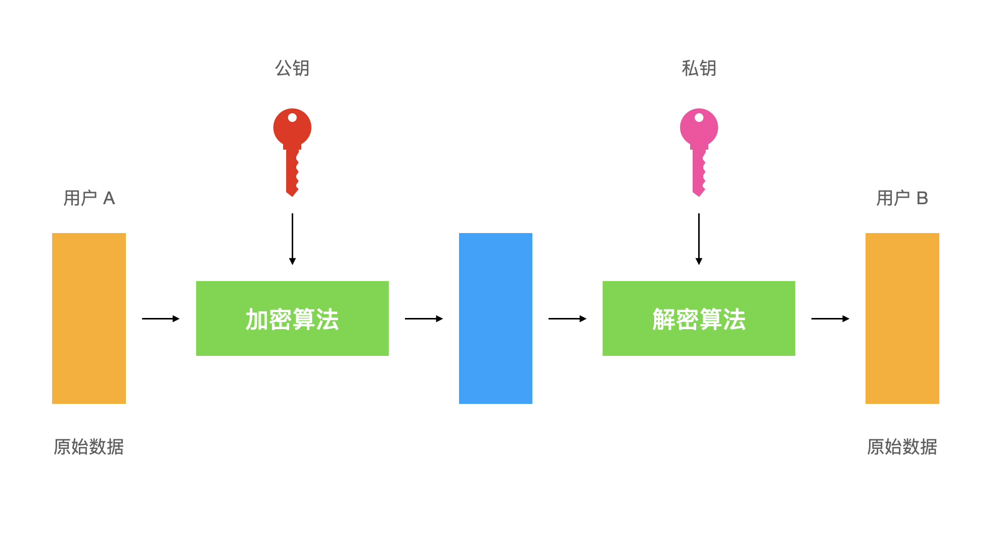
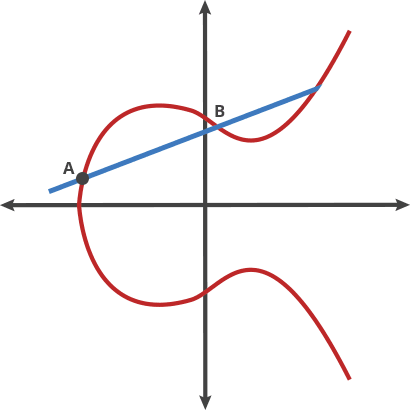
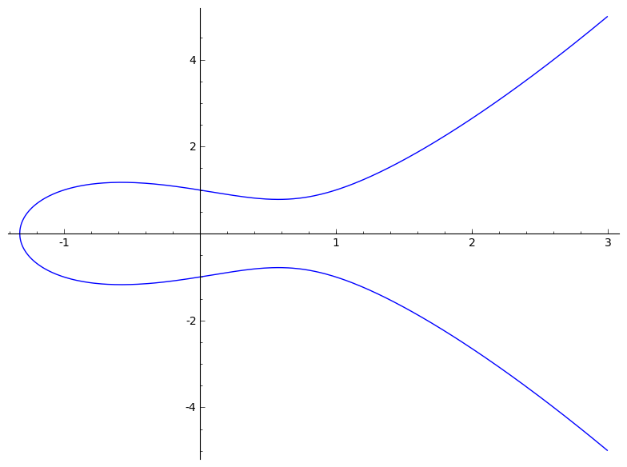
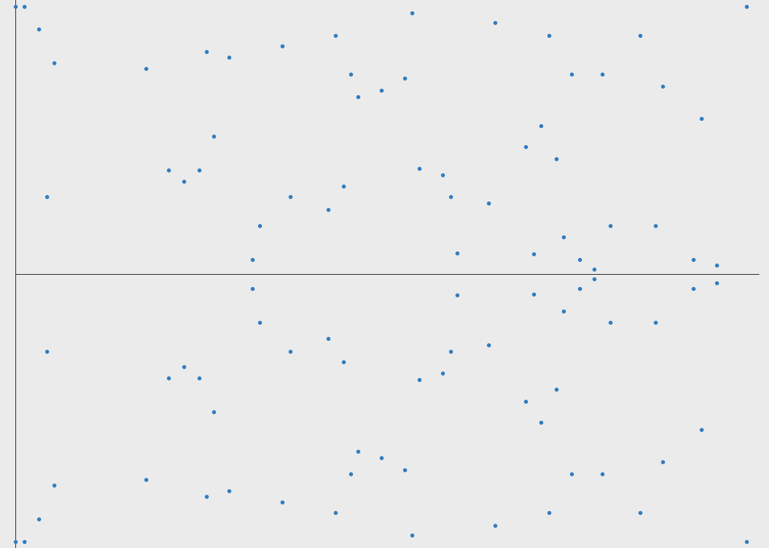

## 区块链的基石 - ECC 椭圆曲线密码学


### 前言

椭圆曲线密码学在当今有非常广泛的应用。美国政府用它保护内部通信安全；Tor 用它确保匿名性；比特币网络用它确保 token 的所有权；苹果用它进行 iMessage 服务的签名；DNSCurve 用它加密 DNS 信息；CloudFlare 用它加密用户的 HTTPS 连接以及数据中心之间的数据传输。

了解、掌握椭圆曲线密码学对我们来说很重要，谷歌搜了一圈，没找到很好的中文介绍，所以决定写一篇相对详细的文章。


### ECC 是公钥加密

现今有非常多的公钥加密算法，椭圆曲线只是其中之一。其他的有 RSA、Diffie-Helman 等等。我们先简单介绍一下公钥加密是如何工作的，如下图所示。



我们生成了两把钥匙，一把公钥，一把私钥。公钥是对外公开的，任何人都可以拿它对数据进行加密。私钥是留在自己手里的，用于解密公钥加密后的数据。

### 举一个例子🌰

现在假设特朗普要发 Tweet 了, 为了确保这条 Tweet 的内容在经过互联网传输的过程中不被中间人偷看(比如 NSA，或者网络提供商)，Twitter 需要使用公钥对 Tweet 进行加密。完整流程如下:

* 特朗普打开 Twitter 客户端准备发 Tweet 了。
* Twitter 下发公钥到特朗普刚打开的 Twitter 客户端。
* 特朗普输入文字后点击发送按钮，Twitter 客户端使用公钥对内容进行加密:

"CNN is fake news." + Public Key = "s80s1s9sadjds9s"

* 加密后的内容被发送到 Twitter 服务器。
* Twitter 使用私钥对内容进行解密:

"s80s1s9sadjds9s" + Private Key = "CNN is fake news."

整个过程看起来非常简单，其中有几个关键的点值得留意:

* 公钥是公开的，可以发送给任何人。
* 私钥必须保存在自己手里，如果泄漏了，那么 TA 可以用私钥解密任何公钥加密的信息。
* 计算机进行加解密的过程非常快。
* 如果没有私钥，计算机需要非常长的时间(百万年)破解加密的内容。

### 公钥加密原理是什么，单向陷门函数

所有公钥加密算法的核心是它们都有自己独特的单向陷门函数。

```
单向陷门函数是有一个陷门的一类特殊单向函数。单向陷门函数包含两个明显特征：一是单向性，二是存在陷门。
所谓单向性，也称不可逆性，即对于一个函数y=f(x)，若已知x要计算出y很容易，但是已知y要计算出x=f ^(-1) (y)则很困难。
单向函数的命名就是源于其只有一个方向能够计算。所谓陷门，也被称为后门。
对于单向函数，若存在一个z使得知道z则可以很容易地计算出x=f ^(-1) (y)，
而不知道z则无法计算出x=f ^(-1) (y)，则称函数y=f(x)为单向陷门函数，而z称为陷门。
(摘自百度百科)
```

这个不是陷门函数: A + B = C

如果 A 和 B 可以计算出 C，同时 C 和 A 可以计算出 B，这不是陷门函数。

陷门函数意味着:

"CNN is fake news." + Public Key --> s80s1s9sadjds9s

通过陷门函数我可以将 "CNN is fake news." 和 Public Key 计算出 s80s1s9sadjds9s，反之，通过 Public Key 和 s80s1s9sadjds9s，我无法计算出 "CNN is fake news."

### 为什么 ECC (椭圆曲线密码学)很特别

如果你在用 RSA，那么你应该很容易理解 ECC。RSA、ECC 都是通过生成公私钥对以保障通信双方的数据安全。然而 256 位私钥的 ECC 可以达到 RSA 3072 位私钥的安全性，仅需 RSA 10% 的存储以及带宽消耗。更少位数的私钥，更低的性能消耗。特别适合资源有限的设备，比如手机、嵌入式设备、区块链节点。

```
我们可以计算一下破解加密算法需要消耗的能量可以把多少水烧开(类似于碳排放量测试)。
破解 228 位的 RSA 私钥比烧开一汤匙的水消耗的能量还要低。
然而破解 228 位的椭圆曲线私钥消耗的能量，可以把整个地球的水都烧开。RSA 需要 2380 位的私钥才能达到这个安全级别。
摘自[《Universal security, from bits and mips to pools, lakes – and beyond》](https://eprint.iacr.org/2013/635.pdf)
```
 
### 了解 ECC 陷门函数

本章的核心来了，以 secp256k1 为例，ECC 的陷门函数非常特别，它看起来像是在打台球。首先，我们在曲线上确定一个起点，然后我们用一个方法(dot function) 去找到下一个点。重复调用 dot 方法，直到我们到达最后一个点。如下图所示:



* 从 A 点开始。
* A dot B = -C (从 A 点画一条直线到 B 点，直线与曲线相交于 -C 点)
* 取 -C 点的 X 轴对称点 C。
* A dot C = -D (从 A 点画一条直线到 D 点，直线与曲线相交于 -D 点)
* 取 -D 点的 X 轴对称点 D。
* A dot D = -E (从 A 点画一条直线到 E 点，直线与曲线相交于 -E 点)
* 取 -E 点的 X 轴对称点 E。

这个陷门函数牛逼之处在于，如果你知道起点和 dot 方法的执行次数，很容易就可以计算出终点在哪。反之，如果只知道起点和终点，那么近乎不可能计算出 dot 方法执行了多少次。

Public Key: 终点 E 

Private Key: A 到 E 共计执行了几次 dot 方法

```
问：如果起点 A 是提前设置好的，那么 B 点是怎么来的？一条直线必须要两个点才能连起来。
答：A dot A = -B (从曲线 A 点画一条切线，与曲线相交与 -B 点，取 -B 点的 X 轴对称点为 B 点)
```

### 深入理解 ECC 

上面简单的曲线动画很直观的帮助我们理解 ECC 的概念，但是实际使用当中较之更复杂一些。

首先，跟 RSA 一样，我们限制 dot 方法在一个固定的数字范围内运行。

举例说明，这是曲线 y2 = x3 - x + 1 的部分视图:



如果把点的最大值设置为 97，则整数点的分布如下图所示:


虽然看起来很难想象这是一条曲线，但它就是。由于最大值为 97，如果 dot 方法的结果大于 97，那么它会被折回。再加上我们只标出了整数点，所以看起来会有点怪。我们依然可以从图中看出这些点是基于 X 轴对称的。

实际上，我们还是可以在这张图上面打台球，把相关的点都连起来。如下图所示，当 A dot B 的直线碰到球桌边界时，它神奇的出现在了台球桌的另一面，并且继续画直线。如果又遇到了边界，又神奇的出现在了台球桌的另一面，直到直线跟曲线相交点的位置小于最大值。



到这里，我们可以这样理解椭圆曲线加密体系，有一个大质数作为最大值，有一个曲线方程，有一个公开的起点。私钥是数字 priv，公钥是起点被执行 priv 次 dot 方法的点。


```
椭圆曲线密码学（英语：Elliptic curve cryptography，缩写为ECC），一种建立公开密钥加密的算法，基于椭圆曲线数学。
椭圆曲线在密码学中的使用是在1985年由Neal Koblitz和Victor Miller分别独立提出的。
ECC的主要优势是在某些情况下它比其他的方法使用更小的密钥——比如RSA加密算法——提供相当的或更高等级的安全。
ECC的另一个优势是可以定义群之间的双线性映射，基于Weil对或是Tate对；双线性映射已经在密码学中发现了大量的应用，例如基于身份的加密。
其缺点是同长度密钥下加密和解密操作的实现比其他机制花费的时间长 [1]，但由于可以使用更短的密钥达到同级的安全程度，所以同级安全程度下速度相对更快。
一般认为160比特的椭圆曲线密钥提供的安全强度与1024比特RSA密钥相当。
(摘自百度百科)
```

参考资料:

[A (Relatively Easy To Understand) Primer on Elliptic Curve Cryptography](https://blog.cloudflare.com/a-relatively-easy-to-understand-primer-on-elliptic-curve-cryptography/)

[(Very) Basic Intro To Elliptic Curve Cryptography](https://qvault.io/2020/09/17/very-basic-intro-to-elliptic-curve-cryptography/)
