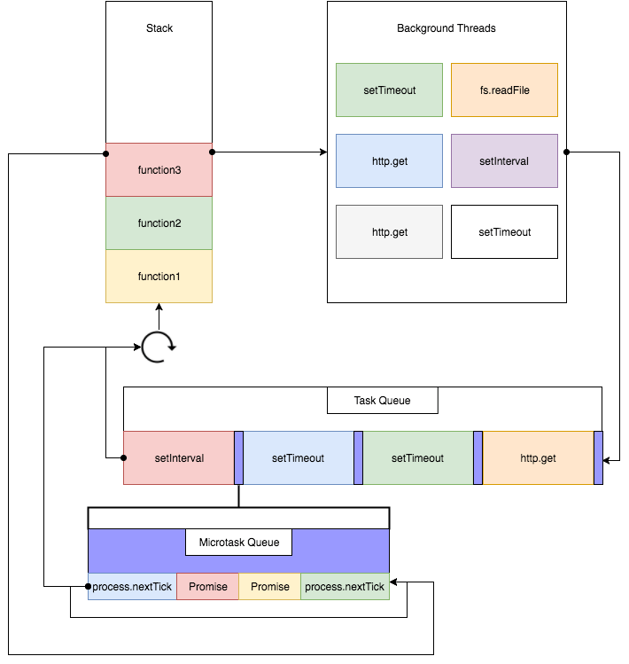

# Javascript Event Loop



* 图片源自[https://cloud.tencent.com/developer/article/1332957](https://cloud.tencent.com/developer/article/1332957)


Node.js 版本的主要区别


测试代码：

```
console.log('immediate0');
setImmediate(() => console.log('immediate1'));
setImmediate(() => {
  console.log('immediate2')
  Promise.resolve().then(() => console.log('promise resolve'))
});
setImmediate(() => console.log('immediate3'));
setImmediate(() => console.log('immediate4'));
```

上述代码在 Chrome 以及 Node 11 运行结果为：

```
immediate0
immediate1
immediate2
promise resolve
immediate3
immediate4
```

在 Node 10 运行结果为：

```
immediate0
immediate1
immediate2
immediate3
immediate4
promise resolve
```

如代码输出所示，在 Javascript 事件循环机制中，分为宏任务(setInterval, setTimeout, http.get)和微任务(process.nextTick, Promise)两种。

宏任务会在每次循环中优先执行。执行完队首第一个宏任务后，立即开始执行微任务，直到将微任务队列中所有执行完毕，才会开始执行下一个宏任务。

* node 11 之前的版本，宏任务里面的微任务会在所有宏任务队列执行完成以后再执行
* node 11 以及之后的版本，宏任务里面的微任务会在当前宏任务中立即执行
