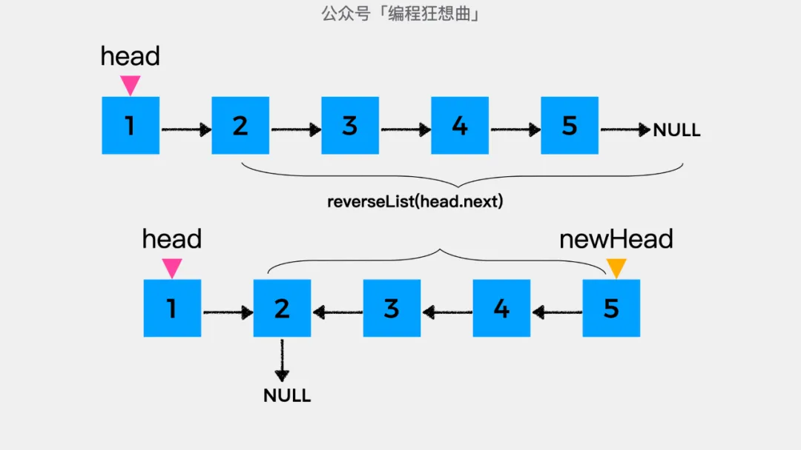
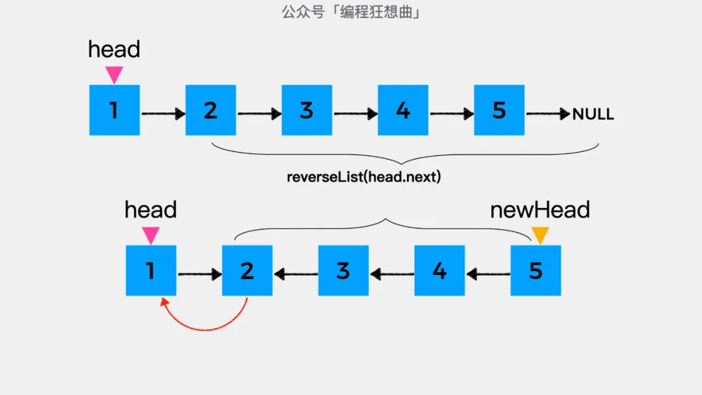

# 链表
```
链表（Linked list）是一种常见的基础数据结构，是一种线性表，但是并不会按线性的顺序存储数据，而是在每一个节点里存到下一个节点的指针(Pointer)。
由于不必须按顺序存储，链表在插入的时候可以达到O(1)的复杂度，比另一种线性表顺序表快得多，但是查找一个节点或者访问特定编号的节点则需要O(n)的时间，
而顺序表相应的时间复杂度分别是O(logn)和O(1)。

使用链表结构可以克服数组链表需要预先知道数据大小的缺点，链表结构可以充分利用计算机内存空间，实现灵活的内存动态管理。
但是链表失去了数组随机读取的优点，同时链表由于增加了结点的指针域，空间开销比较大。
(摘自维基百科)
```

关于链表与数组的区别，可以参考这篇文章。[Difference between Linked List and Arrays](https://www.faceprep.in/data-structures/linked-list-vs-array/#:~:text=Arrays%20Vs%20Linked%20Lists&text=An%20array%20is%20a%20collection,randomly%20using%20the%20array%20index.)


### 单链表反转
```
输入: 1->2->3->4->5->NULL
输出: 5->4->3->2->1->NULL
```

#### 代码示例(迭代)
```
/**
 * Definition for singly-linked list.
 * function ListNode(val, next) {
 *     this.val = (val===undefined ? 0 : val)
 *     this.next = (next===undefined ? null : next)
 * }
 */
/**
 * @param {ListNode} head
 * @return {ListNode}
 */
var reverseList = function(head) {
    let prev = null;
    let current = head;
    let nextTemp = null;
    while(current!=null){
        nextTemp = current.next;
        current.next = prev;
        prev = current;
        current = nextTemp;
        // [current.next,prev,current] = [prev,current,current.next]; ES6 Only
    }
    return prev;
};
```

##### 思路分析(迭代)
```
1->2->3->4->5->NULL
NULL<-1->2->3->4->5
NULL<-1<-2->3->4->5
NULL<-1<-2<-3->4->5
NULL<-1<-2<-3<-4->5
NULL<-1<-2<-3<-4<-5
```

#### 代码示例(递归)
```
/**
 * Definition for singly-linked list.
 * function ListNode(val, next) {
 *     this.val = (val===undefined ? 0 : val)
 *     this.next = (next===undefined ? null : next)
 * }
 */
/**
 * @param {ListNode} head
 * @return {ListNode}
 */
var reverseList = function(head) {
    if(head == null || head.next == null){
        return head;
    }
    let prev = reverseList(head.next);
    head.next.next = head;
    head.next = null;
    return prev;
};
```

#### 思路分析(递归)
(图片摘自[编程狂想曲](https://leetcode-cn.com/problems/reverse-linked-list/solution/yi-bu-yi-bu-jiao-ni-ru-he-yong-di-gui-si-67c3/))


递归解题首先要做的是明确递推公式的含义，在这里对于结点1来说，它只需要知道它之后的所有节点反转之后的结果就可以了，也就是说递推公式reverseList的含义是：把拿到的链表进行反转，然后返回新的头结点。


结点1之后的结点，经过递归公式reverseList处理之后的结果如下图：



接着要做的就是反转结点1，也就是将head指向的结点作为其下一个结点的下一个结点，即head.next.next=head。



最后，将head指向的结点的下一个结点置为null，就完成了整个链表的反转。


