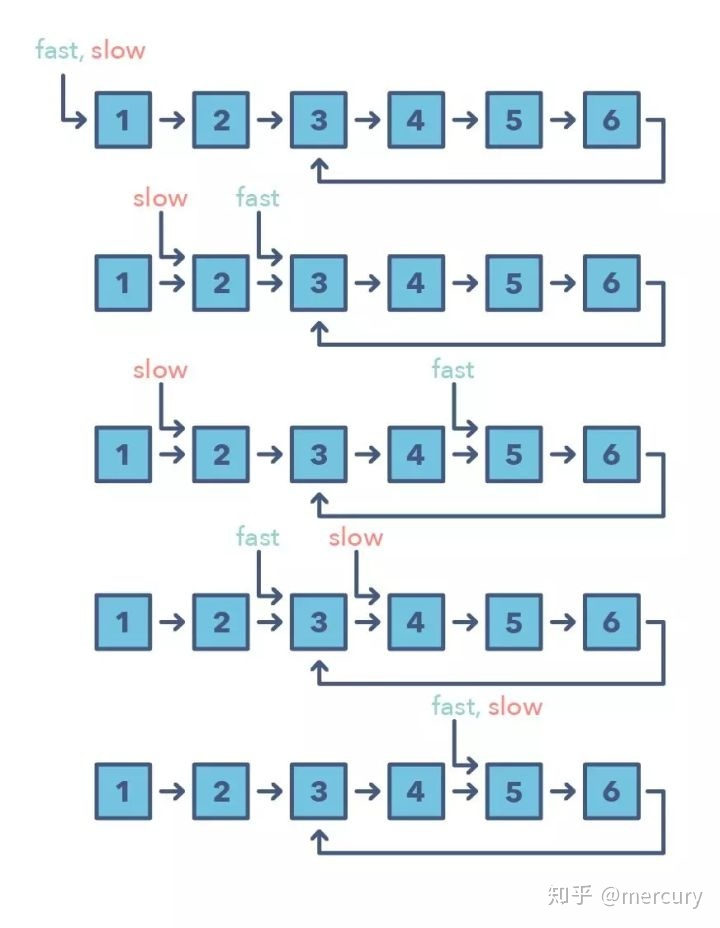

## 环形链表(LeetCode 141 - Linked List Cycle)

### 问题描述

给定一个链表，判断链表中是否有环。
如果链表中有某个节点，可以通过连续跟踪 next 指针再次到达，则链表中存在环。 为了表示给定链表中的环，我们使用整数 pos 来表示链表尾连接到链表中的位置（索引从 0 开始）。 如果 pos 是 -1，则在该链表中没有环。注意：pos 不作为参数进行传递，仅仅是为了标识链表的实际情况。
如果链表中存在环，则返回 true 。 否则，返回 false 。

```
输入：head = [3,2,0,-4], pos = 1
输出：true
解释：链表中有一个环，其尾部连接到第二个节点。
```

```
输入：head = [1,2], pos = 0
输出：true
解释：链表中有一个环，其尾部连接到第一个节点。
```

```
输入：head = [1], pos = -1
输出：false
解释：链表中没有环。
```

#### 代码示例
```
/**
 * Definition for singly-linked list.
 * function ListNode(val) {
 *     this.val = val;
 *     this.next = null;
 * }
 */

/**
 * @param {ListNode} head
 * @return {boolean}
 */
var hasCycle = function(head) {
    if(head == null || head.next == null){
        return false;
    }
    let slow = head;
    let fast = head;
    while(fast != null && fast.next != null){
        slow = slow.next;
        fast = fast.next.next;
        if(slow == fast){
            return true;
        }
    }
    return false;
};
```

##### 思路分析

```
这道题很像中学物理中我们经常遇到的“追击问题”，所以我们可以巧妙的使用快慢指针来模拟追击问题，只要存在环状结构，就一定可以追上。
```

为什么说一定可以追上？想象如下场景：

* 场景1：如果快指针落后慢指针 1 个节点，那么再运行一次，两个指针就能相遇。
* 场景2：如果快指针落后慢指针 2 个节点，那么再运行一次，我们就进入了场景 1。
* 场景3：如果快指针落后慢指针 3 个节点，那么再运行一次，我们就进入了场景 2。
* ...
* 场景 N：如果快指针落后慢指针 N 个节点，那么再运行一次，我们就进入了场景 N - 1。

因此，我们可以认为，快指针与慢指针一定会在环形链表里面相遇。

fast 指针每次移动两格，slow指针每次移动一格，如果存在环路，则fast最终一定会和slow相遇。


