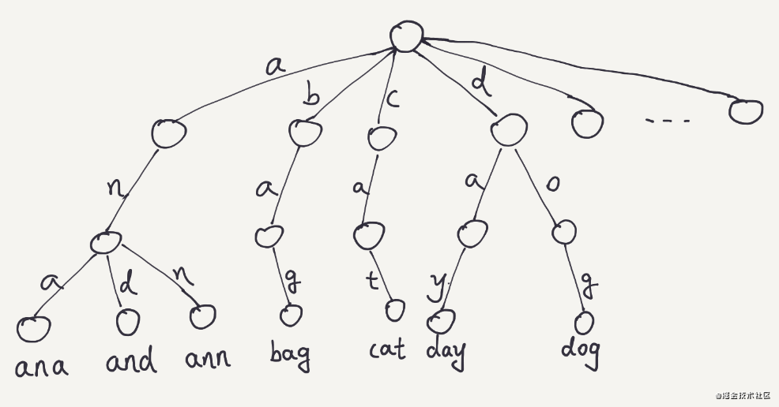

实现一个存储省市地区数据的数据结构。

输入数据如下：

```
let input = [
  { country: 'China', province: 'Fujian', city: 'xiamen', district: 'siming' },
  { country: 'China', province: 'Fujian', city: 'xiamen', district: 'huli' },
  { country: 'China', province: 'Fujian', city: 'fuzhou', district: 'gulou' },
  { country: 'China', province: 'Guangdong', city: 'Shenzhen', district: 'Nanshan' },
  { country: 'China', province: 'Guangdong', city: 'Shenzhen', district: 'Futian' },
  { country: 'China', province: 'Guangdong', city: 'Guangzhou', district: 'Tianhe' },
  { country: 'USA', province: 'California', city: 'Irvine', district: 'Turtle Rock' },
  { country: 'USA', province: 'New York', city: 'New York City', district: 'Brooklyn' }
]
```

思路:
1. 需要有层级关系，国家 -> 省份 -> 地市 -> 区
2. 有大量重复数据，需要想办法合并，以节约存储空间

首先想到的是通过前缀树实现，Trie（发音类似 "try"）或者说 前缀树 是一种树形数据结构，用于高效地存储和检索字符串数据集中的键。这一数据结构有相当多的应用情景，例如自动补完和拼写检查。

(具体 Trie 的内容请参考 LeetCode 208 题，跟这个思路类似。)
[208. 实现 Trie (前缀树)]((https://leetcode-cn.com/problems/implement-trie-prefix-tree/))




如上图所示，我们通过一个树形结构，用少量的空间存储了 ana、and、ann、bag、cat、day、dog 7 个单词，单词越多，节约的空间越多。

回到题目，我们可以把树中的每一个节点替换成省市地区，代码如下。

```
/**
 * Initialize your data structure here.
 */
var Trie = function () {
  this.children = {}
};

/**
* Inserts a word into the trie. 
* @param {string} word
* @return {void}
*/
Trie.prototype.insert = function (word) {
  let node = this.children
  for (let i in word) {
    const item = word[i]
    if (!node[item]) {
      node[item] = {}
    }
    node = node[item]
  }
};

let input = [
  { country: 'China', province: 'Fujian', city: 'xiamen', district: 'siming' },
  { country: 'China', province: 'Fujian', city: 'xiamen', district: 'huli' },
  { country: 'China', province: 'Fujian', city: 'fuzhou', district: 'gulou' },
  { country: 'China', province: 'Guangdong', city: 'Shenzhen', district: 'Nanshan' },
  { country: 'China', province: 'Guangdong', city: 'Shenzhen', district: 'Futian' },
  { country: 'China', province: 'Guangdong', city: 'Guangzhou', district: 'Tianhe' },
  { country: 'USA', province: 'California', city: 'Irvine', district: 'Turtle Rock' },
  { country: 'USA', province: 'New York', city: 'New York City', district: 'Brooklyn' }
]

const trie = new Trie()

for (let item of input) {
  trie.insert(item)
}
console.log(trie.children)
console.log(trie.children.China)
console.log(trie.children.China.Guangdong)
console.log(trie.children.China.Guangdong.Shenzhen)
```

来看看输出结果，基本满足需求。
```
console.log(trie.children)
{ China:
   { Fujian: { xiamen: [Object], fuzhou: [Object] },
     Guangdong: { Shenzhen: [Object], Guangzhou: [Object] } },
  USA:
   { California: { Irvine: [Object] },
     'New York': { 'New York City': [Object] } } }
     
console.log(trie.children.China)
{ Fujian: { xiamen: { siming: {}, huli: {} }, fuzhou: { gulou: {} } },
  Guangdong:
   { Shenzhen: { Nanshan: {}, Futian: {} },
     Guangzhou: { Tianhe: {} } } }

console.log(trie.children.China.Guangdong)
{ Shenzhen: { Nanshan: {}, Futian: {} },
  Guangzhou: { Tianhe: {} } }

console.log(trie.children.China.Guangdong.Shenzhen)
{ Nanshan: {}, Futian: {} }
```
